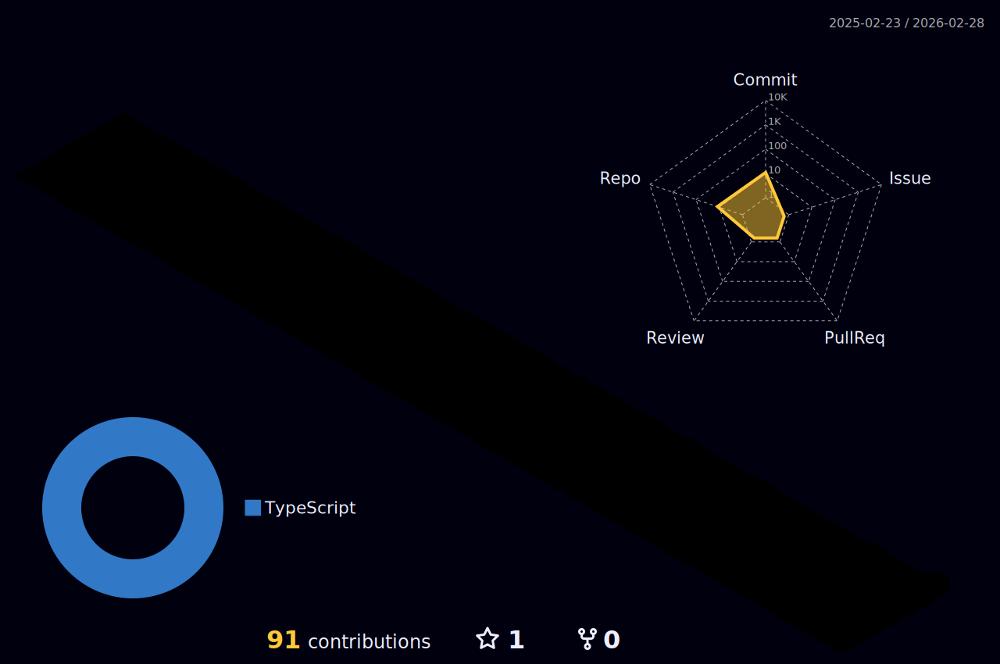

<!-- Dynamic Typing Header -->

  

<!-- 3D Contribution Graph (Generated by Action) - HIDDEN DUE TO ACTION FAILURE

  

-->

 

<!-- Main Content Grid -->
<table align="center">
  <tr>
    <td align="center" width="50%">
      <h3>👨‍💻 About Me</h3>
      

        🚀 Full Stack Developer crafting seamless web experiences. 
        🌌 Visualizing code with <b>Next.js</b> & <b>React</b>. 
        👾 Leveling up in <b>System Design</b>.
      

      
    </td>
    <td align="center" width="50%">
      <h3>🛠️ Tech Arsenal</h3>
       
      

        
      

    </td>
  </tr>
</table>

 

<!-- Snake Animation - HIDDEN DUE TO ACTION FAILURE

  

-->

 

<!-- Stats Dashboard -->

  <h3>📊 Power Level</h3>
   

  
  
  
  
   

  

 

<!-- Footer / Random Joke -->

  
    
  

